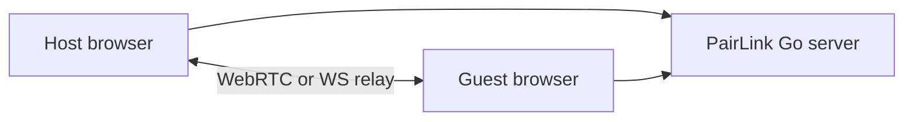

<p align="center">
  
</p>

<p align="center">
  
</p>

<p align="center">
  <strong>Self-hosted, end-to-end file transfer in your browser.</strong>
  <br />
  <sub>WebRTC-first · Resume · Relay fallback · No database</sub>
</p>

<p align="center">
  <a href="https://github.com/hanakokoizumi/PairLink">GitHub</a> •
  <a href="https://github.com/hanakokoizumi/PairLink/releases">Releases</a> •
  <a href="https://github.com/hanakokoizumi/PairLink/pkgs/container/pairlink">Docker</a> •
  <a href="docs/SECURITY.md">Security</a> •
  <a href="DEVELOPMENT.md">Development</a>
</p>

[![CI][ci-badge]][ci-link]
[![Release][release-badge]][release-link]
[![License][license-badge]][license-link]
[![Docker][docker-badge]][docker-link]

[ci-badge]: https://github.com/hanakokoizumi/PairLink/actions/workflows/test.yml/badge.svg
[ci-link]: https://github.com/hanakokoizumi/PairLink/actions/workflows/test.yml
[release-badge]: https://img.shields.io/github/v/release/hanakokoizumi/PairLink
[release-link]: https://github.com/hanakokoizumi/PairLink/releases
[license-badge]: https://img.shields.io/badge/License-MIT-teal.svg
[license-link]: LICENSE
[docker-badge]: https://img.shields.io/badge/docker-ghcr.io-blue
[docker-link]: https://github.com/hanakokoizumi/PairLink/pkgs/container/pairlink

[English](README.md) • [简体中文](docs/README.zh-CN.md)

- [About](#about)
- [Quick Start](#quick-start)
- [How It Works](#how-it-works)
- [Features](#features)
- [Configuration](#configuration)
- [Deployment](#deployment)
- [Browser Support](#browser-support)
- [Development](#development)
- [Security](#security)
- [License](#license)

## About

PairLink is a **self-hosted file transfer** app that runs entirely in the browser. Share files and Markdown messages between two browsers with WebRTC peer-to-peer transfer, encrypted WebSocket relay fallback, and no database required.

- **P2P transfer** — WebRTC DataChannel for direct browser-to-browser delivery
- **Encrypted relay** — ECDH + AES-GCM when WebRTC cannot connect
- **Zero config** — `make dev` with no `.env` for local trials

> [!NOTE]
> No `.env` file is required for local trials. Clone the repo, run `make dev`, and open **http://localhost:3000**.

## Quick Start

### Try locally

```bash
git clone https://github.com/hanakokoizumi/PairLink.git
cd PairLink
make dev
```

Open **http://localhost:3000** → Start connection → share the 5-digit code → transfer.

### Docker

```bash
docker compose up -d --build
# or
make docker-up
```

See [Configuration](#configuration) for production overrides.

## How It Works



1. Host creates a room (auth optional when `PAIRLINK_USERS` or OIDC is configured).
2. Guest joins with a 5-digit code or URL — no login required.
3. Files and Markdown messages flow peer-to-peer; the relay path is end-to-end encrypted.

## Features

| | |
| --- | --- |
| Zero-config dev | Clone and `make dev` — no `.env` needed |
| Resume transfers | IndexedDB-backed breakpoint resume |
| Markdown messages | GFM, syntax highlight, mask-on-send |
| i18n | zh-CN, en, zh-TW, ja, ko |
| Self-hosted | Go API server + Next.js frontend, no database |
| Security | CSP, rate limits, bcrypt / OIDC auth (optional) |

## Configuration

<details>
<summary>Environment variables (optional)</summary>

All settings have sensible defaults. Copy `.env.example` only when you need to override.

| Variable | Default | Description |
| --- | --- | --- |
| `JWT_SECRET` | auto-generated | Set a stable value for production |
| `PAIRLINK_USERS` | empty | `user:bcrypt\|...` — enables local login |
| `PUBLIC_URL` | `http://localhost:8080` | Public base URL for links and CORS |
| `DISABLE_AUTH` | auto | `true` when no users and OIDC off |
| `RTC_CONFIG` | Google STUN | JSON ICE servers; add TURN for strict NAT |
| `OIDC_ENABLED` | `false` | Enable OpenID Connect login |
| `WS_FALLBACK` | `true` | Encrypted WebSocket relay when WebRTC fails |

See [`.env.example`](.env.example) for the full list.

```bash
make hash-password PASSWORD=secret   # when enabling local auth
make setup                           # optional: cp .env.example .env
```

</details>

## Deployment

| Method | Command / image |
| --- | --- |
| Docker Compose | `docker compose up -d` or `make docker-up` |
| GHCR image | `ghcr.io/hanakokoizumi/pairlink:latest` |
| Pull & run | `make docker-pull` |
| Binary | `make build && ./bin/pairlink` |

> [!TIP]
> Production checklist: set `JWT_SECRET`, `PUBLIC_URL` (HTTPS), `PAIRLINK_USERS` or OIDC, and TURN for strict NAT (`deploy/coturn/` + `RTC_CONFIG`).

If pulling from GHCR fails in your region, try the mirror image `ghcr.nju.edu.cn/hanakokoizumi/pairlink` (same tags as above).

## Browser Support

| Chrome | Firefox | Safari |
| :---: | :---: | :---: |
| 90+ | 90+ | 15.4+ |

Manual QA: [docs/browser-qa.md](docs/browser-qa.md)

## Development

See [DEVELOPMENT.md](DEVELOPMENT.md) for local setup, debugging, and testing.

```bash
make test    # Go (race) + Vitest
make lint
make build   # production web + server binary
```

## Security

See [Threat model](docs/SECURITY.md) · Report issues via [GitHub Security Advisories](https://github.com/hanakokoizumi/PairLink/security/advisories/new).

## License

[MIT](LICENSE) © [Hanako](https://github.com/hanakokoizumi)
