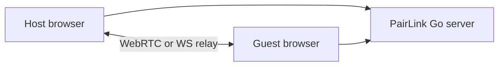

<!-- 1. HEADER -->
<p align="center">
  
  <br />
  <strong>Self-hosted, end-to-end file transfer in your browser.</strong>
  <br />
  <sub>WebRTC-first · Resume · Relay fallback · No database</sub>
</p>

<p align="center">
  <a href="https://github.com/hanakokoizumi/PairLink/actions/workflows/test.yml"></a>
  <a href="https://github.com/hanakokoizumi/PairLink/releases"></a>
  <a href="LICENSE"></a>
  <a href="https://github.com/hanakokoizumi/PairLink/pkgs/container/pairlink"></a>
</p>

<!-- 3. ONE-LINER FEATURES -->
<p align="center">
  <table>
    <tr>
      <td align="center"><strong>P2P Transfer</strong><br/>WebRTC DataChannel</td>
      <td align="center"><strong>Encrypted Relay</strong><br/>ECDH + AES-GCM</td>
      <td align="center"><strong>Zero Config</strong><br/><code>make dev</code> — no .env</td>
    </tr>
  </table>
</p>

<!-- 4. QUICK START -->
## Quick Start

### Try locally (no configuration)

```bash
git clone https://github.com/hanakokoizumi/PairLink.git
cd PairLink
make dev
```

Open **http://localhost:3000** → Start connection → share the 5-digit code → transfer.

No `.env` file required. Defaults enable passwordless room creation for local trials.

### Docker

```bash
docker compose up -d --build
# or
make docker-up
```

No `.env` required for a local trial. See [Configuration](#configuration) for production overrides.

## How it works



1. Host creates a room (auth optional when `PAIRLINK_USERS` or OIDC is configured).
2. Guest joins with a 5-digit code or URL — no login required.
3. Files and Markdown messages flow peer-to-peer; the relay path is end-to-end encrypted.

## Features

- **Zero-config dev** — clone and `make dev`, no `.env` needed
- **Resume transfers** — IndexedDB-backed breakpoint resume
- **Markdown messages** — GFM, syntax highlight, mask-on-send
- **i18n** — zh-CN, en, zh-TW, ja, ko
- **Self-hosted** — Go API server + Next.js frontend, no database
- **Security** — CSP, rate limits, bcrypt / OIDC auth (optional)

## Configuration

<details>
<summary>Environment variables (optional)</summary>

All settings have sensible defaults. Copy `.env.example` only when you need to override.

| Variable | Default | Description |
|----------|---------|-------------|
| `JWT_SECRET` | auto-generated | Set a stable value for production |
| `PAIRLINK_USERS` | empty | `user:bcrypt\|...` — enables local login |
| `PUBLIC_URL` | `http://localhost:8080` | Public base URL for links and CORS |
| `DISABLE_AUTH` | auto | `true` when no users and OIDC off |
| `RTC_CONFIG` | Google STUN | JSON ICE servers; add TURN for strict NAT |
| `OIDC_ENABLED` | `false` | Enable OpenID Connect login |
| `WS_FALLBACK` | `true` | Encrypted WebSocket relay when WebRTC fails |

See [`.env.example`](.env.example) for the full list.

```bash
make hash-password PASSWORD=secret   # when enabling local auth
make setup                           # optional: cp .env.example .env
```
</details>

## Deployment

| Method | Command / image |
|--------|-----------------|
| Docker Compose | `docker compose up -d` or `make docker-up` |
| GHCR image | `ghcr.io/hanakokoizumi/pairlink:latest` |
| Pull & run | `make docker-pull` |
| Binary | `make build && ./bin/pairlink` |

Production checklist: set `JWT_SECRET`, `PUBLIC_URL` (HTTPS), `PAIRLINK_USERS` or OIDC, and TURN for strict NAT (`deploy/coturn/` + `RTC_CONFIG`).

If pulling from GHCR fails in your region, try the mirror image `ghcr.nju.edu.cn/hanakokoizumi/pairlink` (same tags as above).

## Browser support

| Chrome | Firefox | Safari |
|:------:|:-------:|:------:|
| 90+ | 90+ | 15.4+ |

Manual QA: [docs/browser-qa.md](docs/browser-qa.md)

## Development

See [DEVELOPMENT.md](DEVELOPMENT.md) for local setup, debugging, and testing.

```bash
make test    # Go (race) + Vitest
make lint
make build   # production web + server binary
```

## Security

See [Threat model](docs/SECURITY.md) · Report issues via [GitHub Security Advisories](https://github.com/hanakokoizumi/PairLink/security/advisories/new).

## License

MIT © [Hanako](https://github.com/hanakokoizumi)

<p align="center">
  <a href="docs/README.zh-CN.md">简体中文</a>
</p>
